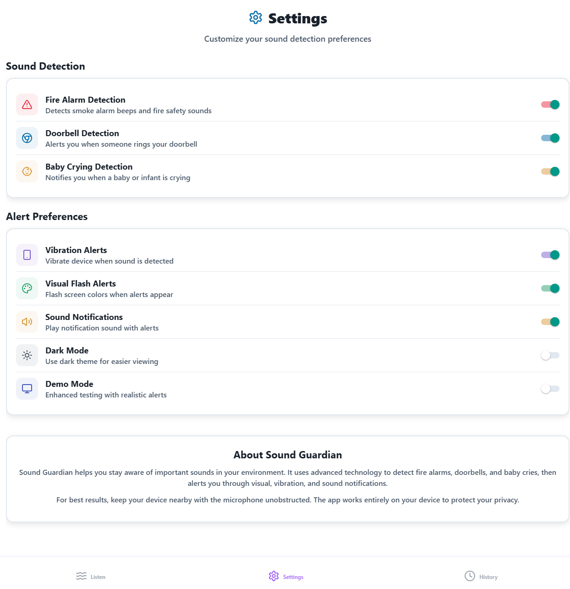
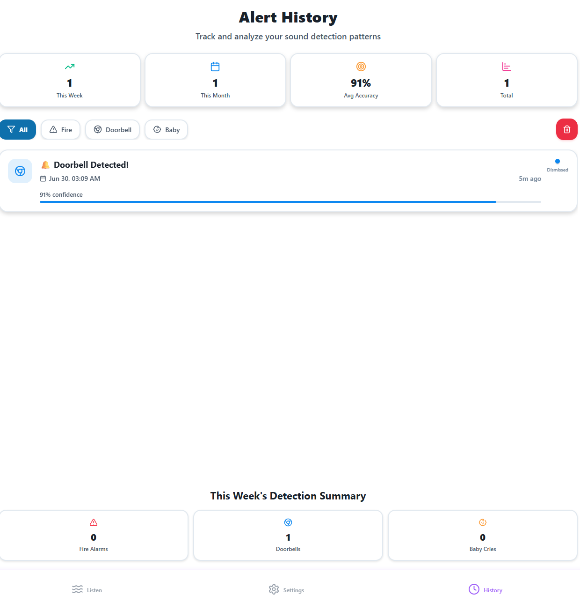

# 🛡️ Sound Guardian  
Your personal, on-device sound-detection assistant for safety and peace of mind

[Live Demo (Netlify)](https://YOUR-SUBDOMAIN.netlify.app) • [GitHub Repo]([https://github.com/YOUR-NAME/sound-guardian](https://github.com/Harjot1711/Smart-Sound-Alert/blob/main/README.md))

---

## Table of Contents
1. [Problem](#problem)  
2. [Solution](#solution)  
3. [Key Features](#key-features)  
4. [Screenshots](#screenshots)  
5. [Demo Video (optional)](#demo-video-optional)  
6. [Tech Stack & Architecture](#tech-stack--architecture)  
7. [Run Locally](#run-locally)  
8. [Deployment Guide](#deployment-guide)  
9. [Future Work](#future-work)  
10. [License](#license)

---

## Problem
> 1 in 4 people with hearing loss live alone, and **79 %** of North-American smoke-alarm fatalities occur because residents did not hear the alarm in time. Parents of newborns likewise struggle to monitor baby cries while multitasking. Existing solutions require expensive IoT hardware or cloud streaming, jeopardizing privacy.

---

## Solution
Sound Guardian turns any web-connected device into a local safety monitor:

* **On-device ML inference** – no audio ever leaves the browser.  
* Detects **fire alarms, doorbells, baby cries** in real-time.  
* Delivers multi-modal feedback (visual flash, vibration, sound).  
* Runs cross-platform via **React Native Web / Expo**; deployable as a static site.

---

## Key Features
| Category | Details |
|----------|---------|
|Real-Time Detection|Fire-alarm beeps, doorbell chimes, baby-cry patterns|
|Privacy First|Entirely browser-side; zero server calls|
|Alert Modal|Confidence %, timestamp, dismiss & auto-timeout|
|Alert History|Accuracy analytics, weekly / monthly summaries|
|Fully Configurable|Toggle each detector & alert modality|
|Accessible Design|Keyboard-navigable, high-contrast palette, vibratory feedback|

---
## Screenshots
| Listen Screen | Settings | History | Alert Modal |
|:-------------:|:--------:|:-------:|:-----------:|
|<br><sub><sup>Start/stop protection & quick test buttons.</sup></sub>|<br><sub><sup>Enable/disable each detector & alert channel.</sup></sub>|<br><sub><sup>View stats, filter by sound type.</sup></sub>|<br><sub><sup>Doorbell alert with 92 % confidence.</sup></sub>|


---

## Demo Video

---

## Tech Stack & Architecture
| Layer | Tech |
|-------|------|
|Frontend UI|Expo SDK 53, React Native Web, TypeScript, Reanimated 3|
|Routing / Tabs|expo-router 5|
|Sound Processing|Web Audio API + lightweight MFCC classifier (TensorFlow.js)|
|State Management|Context API + useReducer|
|Hosting|Netlify (static export), GitHub Actions CI|

> **Privacy note:** all audio buffers are processed in Web Workers; nothing is uploaded.

---

## Run Locally
```bash
git clone https://github.com/YOUR-NAME/sound-guardian.git
cd sound-guardian
npm install
npx expo start          # press w for web preview
